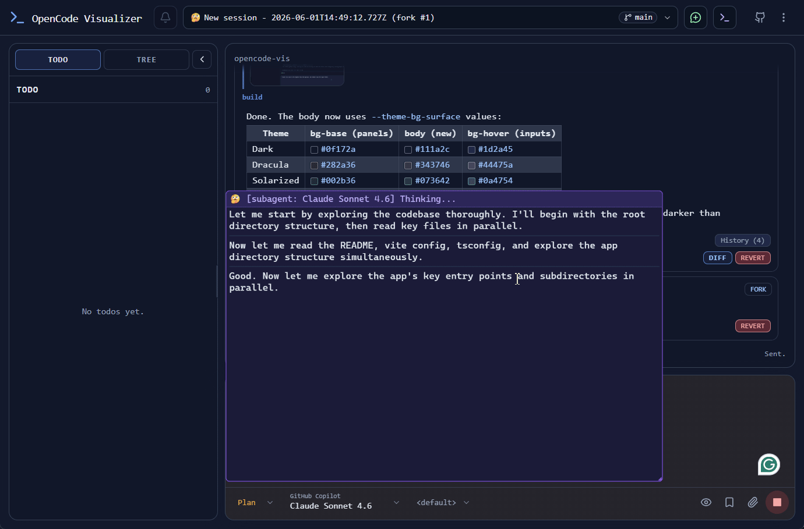
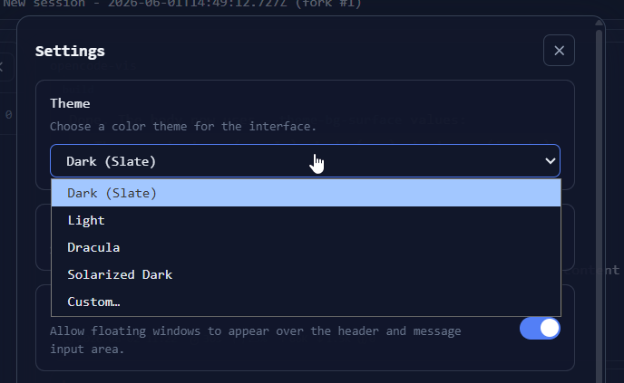
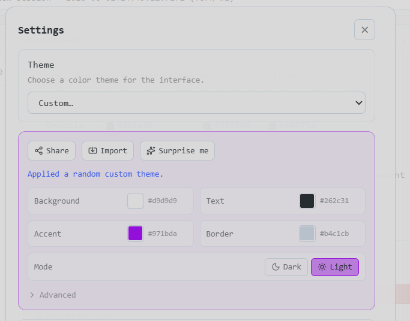
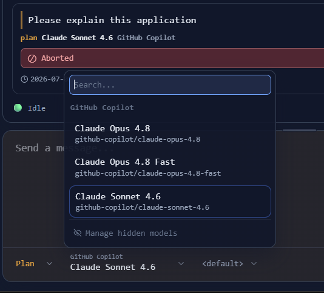
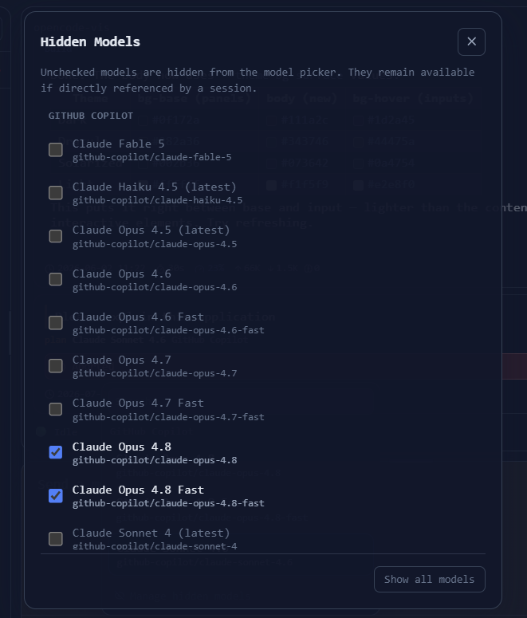

<div align="center">
  
  # openui
  
   
<a href="https://visitor-badge.laobi.icu" title="Go to Source">
  <picture>
      
  </picture>
</a>

An alternative web UI for [OpenCode](https://github.com/sst/opencode), designed for daily use. It connects to a running OpenCode instance and provides a browser-based, window-style interface for managing sessions, viewing tool output, and interacting with AI agents in real time.

  

Live demo: [https://sebbejohansson.github.io/openui/](https://sebbejohansson.github.io/openui/)

</div>

---

## Features

- **Review-first floating windows** that keep tool output and agent reasoning in context
- Session management with **multi-project and worktree** support, plus a searchable, sorted **sessions modal**
- **Customizable themes** with a built-in theme selector and support for your own custom themes
- **Model picker** with clear provider/model info, the ability to **hide models** you don't use, and **per-agent model memory** that remembers your choice for each agent
- Syntax-highlighted **code and diff viewers** built for fast, confident review
- Permission and question prompts for interactive agent workflows
- **Responsive mobile view** for reviewing sessions on the go
- **Notification sounds** (peon ping stream support) to stay aware of agent activity
- Robust **error handling** and cross-platform support (including Windows file trees)
- Embedded terminal powered by xterm.js
- Support for **Github Copilot Auto Mode** with the plugin <a href="https://github.com/m0wer/opencode-github-copilot-auto-model">opencode-github-copilot-auto-model</a>

## Showcase

### Theme selector & custom themes

Pick from a range of built-in themes or craft your own custom theme to make the UI your own.

<p>
  
  
</p>

### Model selector & hiding models

Quickly switch between models and hide the ones you never use to keep the picker focused.

<p>
  
  
</p>

## How to Use

### Cloud

**No installation required** - just open the hosted version in your browser:

**<https://sebbejohansson.github.io/openui/>**

All you need is a running OpenCode server with CORS enabled. Start it with:

```bash
opencode serve --cors https://sebbejohansson.github.io
```

Or add this to your `.config/opencode/opencode.json`:

```json
{
  "$schema": "https://opencode.ai/config.json",
  "server": {
    "cors": ["https://sebbejohansson.github.io"]
  }
}
```

and then:

```bash
opencode serve
```

### Local

The hosted version connects to your local OpenCode server, which some browsers may block due to security restrictions.
If this happens, you can serve the UI locally instead:

Start the UI server:

```bash
npx opencode-vis
```

Start the OpenCode API server:

```bash
opencode serve
```

Then open `http://localhost:3000` in your browser.

---

## Development

```sh
bun install
bun dev
```

## Support the project

<div>
  <ul>
    <li>⭐ the repo</li>
    <li><a href="https://github.com/SebbeJohansson/openui/issues">Help us improve</a></li>
  </ul>
  <div>
    <a href="https://www.buymeacoffee.com/sebbejohansson"></a>
  </div>
  <br>
</div>

## License

MIT - see [LICENSE](./LICENSE) for details.

## Origins

This project originated as a fork of [xenodrive/vis](https://github.com/xenodrive/vis). It was separated from the fork network because the original project saw no continued development, and this version has since deviated significantly in both features and architecture.
