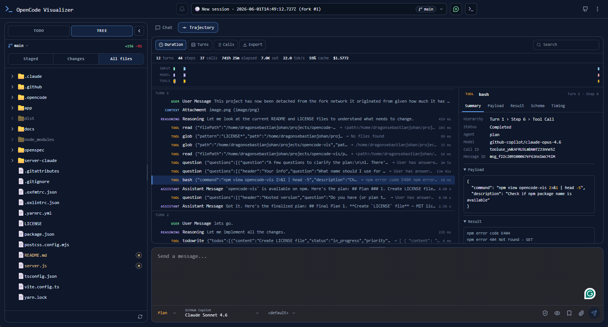

<div align="center">
  
  # openui
  
  

A web UI for [OpenCode](https://github.com/sst/opencode) and the [Claude Code CLI](https://github.com/anthropics/claude-code), meant for daily use. It talks to a running OpenCode server, the Claude Code CLI, or both at once, and puts sessions, tool output and live agent activity in a browser-based, window-style interface.

  

Live demo: [https://sebbejohansson.github.io/openui/](https://sebbejohansson.github.io/openui/)

<div>

_previously known as opencode-vis_

</div>

</div>

---

## Features

- **Review-first floating windows** that keep tool output and agent reasoning in context
- **Trajectory view** flattens the whole session into one chronological stream (system prompts, user turns, context injections, reasoning, tool calls and results, subagents) with a lane timeline, per-record payload/result/timing inspection, search, and JSON export
- **Session management** across multiple projects and worktrees, plus a searchable, sorted sessions modal
- **Themes** with a built-in selector, or write your own
- **Model picker** with clear provider and model info, a way to hide models you don't use, and per-agent memory of the model you picked last
- **Code and diff viewers** with syntax highlighting
- **Permission and question prompts** for interactive agent workflows
- **Mobile view** for reviewing sessions away from your desk
- **Notification sounds**, including peon ping streams, so you notice when an agent wants you
- Error handling and cross-platform support, including Windows file trees
- Embedded terminal powered by xterm.js
- Support for Github Copilot Auto Mode through the <a href="https://github.com/m0wer/opencode-github-copilot-auto-model">opencode-github-copilot-auto-model</a> plugin

#### Experimental features

- **Claude Code CLI support** served by the built-in API. OpenCode and Claude Code sessions sit side by side in the same UI

## Showcase

### Trajectory view

Every record in a session on one timeline, with the payload, result and timing behind each one.

<p>
  
</p>

### Theme selector and custom themes

Pick one of the built-in themes, or define your own colors.

<p>
  
  
</p>

### Model selector and hidden models

Switch models mid-session, and hide the ones you never touch so the list stays short.

<p>
  
  
</p>

## How to use

### Cloud

Nothing to install. Open the hosted version in your browser:

**<https://sebbejohansson.github.io/openui/>**

You need a running OpenCode server with CORS enabled. Start it with:

```bash
opencode serve --cors https://sebbejohansson.github.io
```

Or add this to your `.config/opencode/opencode.json`:

```json
{
  "$schema": "https://opencode.ai/config.json",
  "server": {
    "cors": ["https://sebbejohansson.github.io"]
  }
}
```

and then:

```bash
opencode serve
```

### Local (OpenCode only)

The hosted version connects to your local OpenCode server, which some browsers block for security reasons.
When that happens, serve the UI locally instead.

Start the UI server:

```bash
npx openui
```

Start the OpenCode API server:

```bash
opencode serve
```

Then open `http://localhost:3000` in your browser.

---

### Local (OpenCode + Claude Code)

The server can also run Claude Code CLI sessions. Both kinds appear in the same
session dropdown, and you can run them side by side.

**Requirements:**

- OpenCode running on its default port (4096, or set `OPENCODE_URL`)
- Claude Code CLI installed (`npm install -g @anthropic-ai/claude-code`)
- Node.js 24 or newer

**Development:**

```bash
EXPERIMENTAL_CLAUDE=true OPENCODE_URL=http://localhost:4096 yarn dev
```

**Production:**

```bash
yarn build
EXPERIMENTAL_CLAUDE=true OPENCODE_URL=http://localhost:4096 yarn start
```

**How it behaves:**

- Your OpenCode sessions appear as normal
- Your Claude Code sessions from `~/.claude/projects/` appear in the same list, with their full conversation history
- To start a new Claude Code session, use "New Claude session" in the session menu
- To resume an old one, just select it. The server reads the session's JSONL log and serves it from `/api/claude/sessions/<id>/messages`, so the thread renders before any subprocess starts. `claude --resume` runs when you send the first prompt

**Environment variables:**

| Variable              | Default     | Description                                                           |
| --------------------- | ----------- | --------------------------------------------------------------------- |
| `EXPERIMENTAL_CLAUDE` | `false`     | Opt in to Claude Code CLI support and expose the `/api/claude` routes |
| `OPENCODE_URL`        | unset       | URL of the running OpenCode server. When unset, the UI asks for it    |
| `VIS_PORT` / `PORT`   | `3000`      | Port the built server listens on (`--port` also works)                |
| `NUXT_CLAUDE_BIN`     | auto-detect | Path to the `claude` binary                                           |

The `NUXT_`-prefixed names (`NUXT_OPENCODE_URL`, `NUXT_CLAUDE_ENABLED`,
`NUXT_CLAUDE_BIN`) work too, and are what a `.env` file should use.

---

## Architecture

```
Browser (Nuxt 4 SPA)
        |
        |  HTTP + SSE, same origin
        v
Nitro server  server/
        |-- GET /api/config              -> which OpenCode server to use, is Claude enabled
        |-- /api/claude/**               -> Claude Code sessions
        |                                   (one `claude` subprocess per session,
        |                                    plus stored history read from ~/.claude/projects/)
        v
Browser also talks directly to the OpenCode server (port 4096) over HTTP + SSE
```

The server translates Claude Code's `stream-json` output into the same SSE
envelope the app already uses for OpenCode, and reshapes stored JSONL logs into
the same message and part records. The UI does not care which backend owns a
session; it sees one flat list of projects and sessions.

**Layout:**

| Path             | Purpose                                                                                                                             |
| ---------------- | ----------------------------------------------------------------------------------------------------------------------------------- |
| `app/`           | The SPA. `pages/index.vue` is the only route; `components/shell/` is the app shell; `composables/` holds one composable per feature |
| `server/`        | Nitro routes (`api/config`, `api/claude/**`) and the Claude subprocess code in `server/utils/claude/`                               |
| `shared/`        | Types and id helpers used by both sides                                                                                             |
| `bin/openui.mjs` | The published launcher; starts the built Nitro server                                                                               |

**Reference docs:**

| Doc                                          | Covers                                                                       |
| -------------------------------------------- | ---------------------------------------------------------------------------- |
| [docs/projects.md](./docs/projects.md)       | The project/sandbox/session data model and the SharedWorker's `stateBuilder` |
| [docs/SSE.md](./docs/SSE.md)                 | The SSE stream shape, in enough detail to write a client parser from scratch |
| [docs/API.md](./docs/API.md)                 | OpenCode server REST API reference                                           |
| [docs/window-arch.md](./docs/window-arch.md) | How windows, viewers and renderers layer to display tool output              |

---

## Development

```sh
yarn install
yarn dev
```

The dev server listens on `http://localhost:5173`. The built server and `npx openui`
listen on 3000 instead. `PORT` or `--port` overrides either one.

Useful scripts:

| Script            | What it does                                                   |
| ----------------- | -------------------------------------------------------------- |
| `yarn dev`        | Nuxt dev server, API included                                  |
| `yarn check`      | Lint, format check, typecheck and tests                        |
| `yarn build`      | Build the Nitro server (what npm ships)                        |
| `yarn generate`   | Build the static site (`NUXT_APP_BASE_URL=/openui/` for Pages) |
| `yarn test`       | Vitest, the whole suite                                        |
| `yarn test:watch` | Vitest in watch mode over `app`, `shared` and `server/utils`   |

Node 24 or newer is required. See [AGENTS.md](./AGENTS.md) for conventions and gotchas.

## Support the project

<div>
  <ul>
    <li>⭐ the repo</li>
    <li><a href="https://github.com/SebbeJohansson/openui/issues">Help us improve</a></li>
  </ul>
  <div>
    <a href="https://www.buymeacoffee.com/sebbejohansson"></a>
  </div>
  <br>
</div>

## License

MIT. See [LICENSE](./LICENSE) for details.

## Origins

This project started as a fork of [xenodrive/vis](https://github.com/xenodrive/vis). It left the fork network because the original saw no continued development, and it has since drifted a long way from it in both features and architecture.
